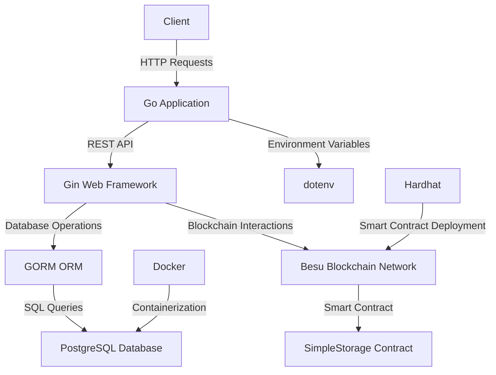

# GoLedger Challenge - BESU Edition

This project is a Go application that interacts with a smart contract on the Besu network and synchronizes its value with a PostgreSQL database. The application provides RESTful endpoints to SET, GET, SYNC, and CHECK the contract value on the blockchain.

## Table of Contents

- [Requirements](#requirements)
- [Installation](#installation)
- [Initialization](#initialization)
- [Set up the Go RESTful API app](#api)
- [Endpoints](#endpoints)

## Requirements

- [Go 1.23+](https://go.dev/doc/install)
- [Hyperledger Besu](https://besu.hyperledger.org/private-networks/get-started/install/binary-distribution)
- [Docker Engine / Docker Compose](https://docs.docker.com/engine/install/)
- [Node.JS](https://nodejs.org/en)
- [NPM / NPX](https://www.npmjs.com/get-npm)
- [Hardhat](https://hardhat.org/hardhat-runner/docs/getting-started)

## Installation

1. **Clone the repository:**

   ```sh
   git clone https://github.com/viniciusr-cmd/goledger-challenge-besu.git
   cd goledger-challenge-besu
   ```
2. **Check if is inside ```app``` folder**
    ```sh
   cd app
   ```
3. **Copy the contents of .env.example to your new env**
    ```sh
    cp .env.example .env
    ```
4. **Check if is inside ```besu``` folder**
    ```sh
   cd .. && cd besu
   ```

5. **Check hardhat installation (You need to install [Node.JS/NPM](https://nodejs.org/en) first)**
    ```sh
    npm install --save-dev hardhat
    ```

## Initialization

Make sure you have installed the requirements. To set up the environment, you need to run the following commands:
    ```bash
        ./startDev.sh
    ```

This will bring up a local Besu network with 4 nodes. You can check the logs of each node by running the following command:

```bash
docker logs -f besu_node-0
```

This will also deploy the PostgresSQL database and a smart contract to the network. The contract is a simple storage contract that has a variable that can be set and get. Note that it will log the contracts address, which will be important later. If you want to check the contract's source code, you can find it in the `contracts` folder. The contract's ABI can be found in the `/besu/artifacts/contracts/SimpleStorage.sol/SimpleStorage.json` file.

If everything goes well, you will see the following terminal output
```bash
    Deploying [ SimpleStorageModule ]
    
    Batch #1
    Executed SimpleStorageModule#SimpleStorage
    
    [ SimpleStorageModule ] successfully deployed 🚀
    Deployed Addresses
    
    SimpleStorageModule#SimpleStorage - 0x42699A7612A82f1d9C36148af9C77354759b210b
```
Please copy the contract address to the .env file inside your ```app``` folder.
Your **CONTRACT_ADDRESS** line should look like the following
```bash
    # Contract address of the deployed contract, found in the output of the deploy script ./startDev.sh
    CONTRACT_ADDRESS = "0x42699A7612A82f1d9C36148af9C77354759b210b"
```

Now we should be ready to configure our app.

## Set up the Go RESTful API app
Now we will set up the Go App RESTful API
1. **Check if is inside ```app``` folder**
    ```sh
     cd .. & cd app
    ```
2. **Install Go Dependencies**
    ```sh
    go mod tidy
    ```
3. **Run app**
    ```sh
    go run .
    ```
If everything goes well, you will see the following GIN terminal output with mapped endpoints
```bash
    [GIN-debug] POST   /set                     
    [GIN-debug] GET    /get                      
    [GIN-debug] GET    /sync                     
    [GIN-debug] GET    /check                    
  ```
 #### **The application will be available at http://localhost:8080**
  
  Now we are ready to run our app.
## Endpoints
The application provides the following endpoints:
| Endpoint | Method | Description | Usage |
|----------|--------|-------------|--------|
| `/set`   | POST   | Set a new value for the smart contract variable. |  ```curl -X POST http://localhost:8080/set -H "Content-Type: application/json" -d '{"value": 123}'```
| `/get`   | GET    | Retrieve the current value of the smart contract variable from the blockchain. | ```curl -X GET http://localhost:8080/get```
| `/sync`  | GET    | Synchronize the value of the smart contract variable from the blockchain to the SQL database. | ```curl -X GET http://localhost:8080/sync```
| `/check` | GET    | Compare the value stored in the database with the current value of the smart contract variable. Return `true` if they are the same, otherwise return `false`. | ```curl -X GET http://localhost:8080/check```

### Endpoints Usage
##### Endpoint: ```/set```
##### Set a new value for the smart contract variable
##### Method: ```POST```
##### Request Body:

```json
{
    "value": 256
}
```

##### Return:
```json
{
	"contractValue": 256,
	"transactionMined": true,
	"transactionStatus": "Success",
	"txId": "0x9e4db680d02b2c52f94c76c5b7616a41a5065decd78984f216ce161ba8c1d8ad"
}
```

##### Endpoint: ```/get```
##### Get value of the smart contract variable
##### Method: ```GET```
##### Return:
```json
{
	"contractValueResult": [
		256
	],
	"transactionStatus": "Success"
}
```

##### Endpoint: ```/sync```
##### Sync value of the smart contract variable on blockchain to database
##### Method: ```GET```
##### Return:
```json
{
	"databaseValue": 256,
	"message": "Successfully synced contract value to database",
	"updatedValue": 256
}
```

##### Endpoint: ```/check```
##### Checks the value of the smart contract on the blockchain and compares with database contract value
##### Method: ```GET```
##### Return:
```json
{
	"contractValue": 256,
	"databaseValue": 256,
	"isEqual": true
}
```
##### Unsynced values:
```json
{
	"contractValue": 256,
	"databaseValue": 0,
	"isEqual": false
}
```

## Technologies Used

- **Go:** The primary programming language used for the application.
- **Gin:** A web framework for building RESTful APIs in Go.
- **GORM:** An ORM library for Go, used for interacting with the PostgreSQL database.
- **PostgreSQL:** The SQL database used to store the smart contract variable values.
- **Docker:** Used deploy blockchain nodes and containerize the PostgreSQL database.
- **Besu:** An Ethereum client used to run the local blockchain network.
- **Hardhat:** A development environment to compile, deploy, test, and debug Ethereum software.

## Architecture
The architecture of this project is designed to interact with a smart contract on the Besu blockchain network and synchronize its value with a PostgreSQL database.


1. **Gin Web Framework:**
   - Provides RESTful API endpoints for interacting with the smart contract and the database.
   - Handles HTTP requests and responses.

2. **GORM ORM:**
   - Manages database interactions with PostgreSQL.
   - Provides an abstraction layer for database operations.

3. **Besu Blockchain Network:**
   - A local Ethereum-compatible blockchain network used for deploying and interacting with smart contracts.
   - The smart contract is deployed on this network and provides methods to set and get a variable.

4. **PostgreSQL Database:**
   - Stores the values of the smart contract variable.
   - Provides persistent storage for the application.

5. **Docker:**
   - Used to containerize the PostgreSQL database for easy setup and management.
   - Ensures a consistent environment for the database.

6. **Hardhat:**
   - A development environment for Ethereum software.
   - Used to compile, deploy, and test the smart contract on the Besu network.

### Flow of Operations

1. **Set Endpoint (`/set`):**
   - Receives a new value via a POST request.
   - Sends the value to the smart contract on the Besu network to update the contract variable.

2. **Get Endpoint (`/get`):**
   - Retrieves the current value of the smart contract variable from the blockchain.
   - Returns the value in the HTTP response.

3. **Sync Endpoint (`/sync`):**
   - Fetches the current value of the smart contract variable from the blockchain.
   - Updates the value in the PostgreSQL database.

4. **Check Endpoint (`/check`):**
   - Compares the value stored in the PostgreSQL database with the current value of the smart contract variable.
   - Returns `true` if the values are the same, otherwise returns `false`.